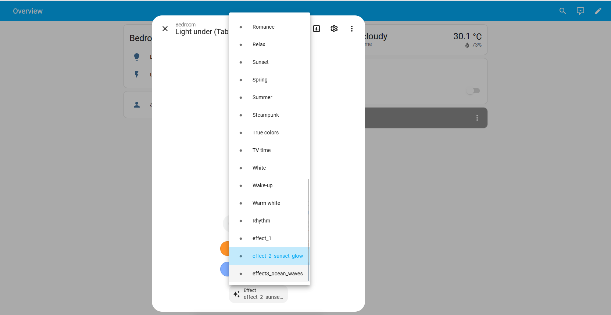

# How to use updated WiZ integration

I assume that you have followed installation process as declared in [documentation](https://developers.home-assistant.io/docs/development_environment/) for home assistant devs to set environment and run it in a docker container.

## Set up
```bash
git clone ssh://git@origin.www.code.dtf.lighting.com:7999/wizrd/ha-homeassistant-wiz-module.git
git branch -a # to get all remote branches
git checkout dev

# wiz-pywizlight library must be created in a home assistant folder
pip install -e ./wiz-pywizlight
```

To run the application press F5, if you are using VS code. Make sure that you are using ```Home Assistant skip pywizlight``` configuration.

## How to use preview effects
When installing WiZ integration you will be prompted to enter **wiz app link**. You can get this link by opening developer mode on WiZ v2 app -> Settings -> Integrations -> Local Integrations -> Get the link

After successful connection with your first WiZ device you need to add special effects ```config/.storage/wiz_home_config``` as shown in this example ```homeassistant/components/wiz/example_config/wiz_home_config```

When you will launch the HA, you should be able to navigate to WiZ device (preferably light bulb) and choose effects here:
